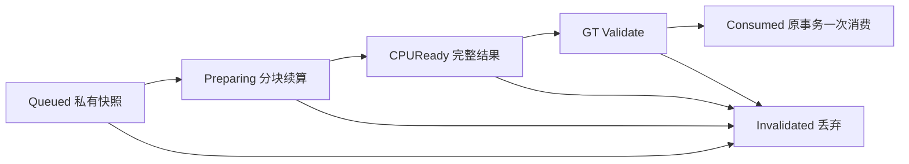

# SightWeave 首次历史准备与发布：跨帧架构定案

日期：2026-09-07。设计起点：开发分支 `084ab5664058badeacb754e1fef6fb487bb71f9d`；实际运行时仍为 `bf48648ee46e119155e16616c977f3a251bc179b`。本文是设计、拟定接口和施工/测试合同，**没有已实现的调度器、接口声明或后台任务**。本轮不修改运行时，不构建、不重跑性能审计；当前 INITIALIZATION 仍 FAIL。

## 1. 决策与不可兼得的约束

采用 **合法 Current 期间预算化预备 → 到期严格校验 → 原 GT 事务消费；未就绪走同帧 oracle**。调度对象是可重新生成的准备产物，不是玩家知识事件。证据提交、资格判定、Current/Gray 切换和失效具有原来的时间与顺序；准备结果不能自己建立 epoch、授予 Whole 确认或恢复历史。

第一生产切片使用 **GT 协作续算**，不启动 worker：一个私有值对象工作包每帧推进有界步骤。跨帧不要求跨线程；先验证实际取消、预算和首次交接，再让同一个纯数据接口接有界 worker。暂不引入通用任务框架、全局资源池、Large World 或新的游戏知识状态。

必须保留以下明确限制：

- 若大量记录都在帧 F 首次出现且必须在 F 显示，同时此前没有完整准备结果，则“严格限制 F 耗时”“零新增首显帧延迟”“完整执行全部工作”不能同时保证。推荐优先保语义与首显，记录预算超支并同帧完成；不能用排队来伪装解决冷启动。
- 当前 `ConfigureHistoricalEpochCountForTesting` 在一个调用内循环产生并 seal 64+64+56 条记录，没有合法 Current 的跨帧提前量。第一切片**不承诺降低这个冷 184 场景的 516–520ms**；不能把 seed 循环分到多帧、挪进预热，再和原基准比较单个最大帧。
- 将来若要求这个“全冷、同时到期”的 184 整批也满足硬帧预算，必须另行确定初始化不可见阶段/交互门槛或允许的首次展示延迟。总就绪时间和首次显示延迟必须同时验收。本文没有授权改变这些外部语义。
- 已经有已发布历史，仍不代表可以一直显示它：新合法反证或 Current 排除改变后，旧像素/旧 cap 可能已经不合法。异步计算“更晚覆盖旧数据”不足以保证正确性，必须当帧执行原证据/表现路径或验证过的同步修正。

## 2. 源码事实与集成边界

下列锚点对应本设计起点；使用函数名定位，行号只辅助阅读。

| 源码入口 | 已确认事实 | 对设计的约束 |
| --- | --- | --- |
| `DarkwellObjectMemoryScene.cpp` `RegisterRememberable`（63） | SOURCE_REPLACED 先按原规则处理 Current，保留旧记录，再替换实际源 | SourceGeneration 失效不能删除既有历史；已封存历史不能依赖新源的姿态/存在 |
| 同文件 `ResetMemory`（126）、`EndPlay`（57）；`DarkwellMovingPropLabRoom.cpp` 两个 `DestroyTracked`（468/496） | 存在多个独立销毁/清空入口 | 不能只在 EndPlay 打取消标记；测试/Lab 直接清空路径也要过失效协议 |
| `DarkwellSpatialObservationHistory.cpp` `Initialize`（5）、`ResumeUncontradictedObservation`（120） | Initialize 将 NextEpoch 重置为 1；同 epoch 可以 Gray→Current→Gray | StableId+Epoch、数组地址、GetUniqueID 或 NextEpoch 单独都不够 |
| `Scene.cpp` `UpdateTracked`（2430起）、`StampConfirmedWholeCapture`（3056附近） | 权威 coverage 合法且修订匹配时才更新 Current/资格；Whole stamp 可每次合法更新重写 | 不把 CoverageDraw 每帧增长当作几何产物改变；资格仍在 GT 当前入口验证 |
| `Scene.cpp` `FreezeCurrentForHiddenMotion`（3133附近） | Whole 先验证 capture/pose/policy/geometry，再算完整 mask；随后隐藏源、封存、初始化 fine、构建 footprint、提交 texture/cap | 不可先隐藏源再等待任务；准备必须在原封存调用消费，未命中就走原路径 |
| `DarkwellCurrentLiveGrid.cpp` `BuildFullGeometryMask`（115）与 `Scene.cpp` `BuildCaptureGeometryFootprint`（3073附近） | 两种 mask 使用不同的既有几何谓词；前者还写 mutable cache，后者写 RuntimeFrame | 不能直接跨帧持有 CurrentLive 或在线程上调用这两个现有包装函数；提取同一谓词的纯值计算，不合并两种 mask |
| `Scene.cpp` historical loop（2840–3050附近） | 原序更新 coarse/fine/ownership/TransientCurrentSuppression，再 texture/cap/retire/compact | 当前帧借用候选/位图/缓存不能逃逸；这些权威推进第一切片完全不调度 |
| `Scene.cpp` `RetireHistoricalPresentation`（1942）、`DestroyVisual`（226附近） | 退休能销毁表现但保留反证；重建 Visual 不等于重新获得知识 | 删除/退役是新票据屏障；迟到结果只能丢弃，不能 FindOrAdd 补回记录 |
| `Scene.cpp` `UpdateMemory`（5718） | 宿主调用而非独立 Actor Tick；本帧 FrameOccupancy 等在入口重建 | 调度由同一个 GT 宿主推进，不另开 Tick；每个真实世界帧仅有一份预算 |
| `MovingPropLabRoom.cpp` `ConfigureHistoricalEpochCountForTesting`（769）；`profile_gray_stabilization.py` setup 段 | 同步 seed 完整计时，随后 reset telemetry/start sweep | 原冷 184 必须保留，新增延迟数据不能只依赖旧 480 行分析器 |

`Prop.TransformRevision` 的变化判定含容差，`SpatialMemory.GetGeneration()` 也不覆盖所有 fine/opacity/ownership 变化；它们不能直接充当新的完整异步版本戳。现有 `bPresentationRetired` 参与较新历史候选选择；将来“资源还没准备好”不能复用这个标志，否则会改变遮盖/反证语义。

## 3. 工作分类与渐进阶段

| 工作 | 允许跨帧的形态 | 必须保留的同步边界 |
| --- | --- | --- |
| 捕获 descriptor、精确域/姿态/尺寸、合法资格 | 在合法 Current 的 GT 创建完整自有快照 | 不可分几帧从可变源拼接一个混合快照；快照复制/分配计入预算 |
| Whole 支持 mask、精确 footprint | 纯值输入、私有游标/输出，GT 分块；后续可 worker | GT consume 重新检查 capture/domain；不能提前写权威 mask 或 CurrentLive cache |
| fine 初始化、像素/签名/Float16、纯 cap 几何 | 后续阶段的不可变 capture/evidence 快照产物 | 当前 P1 保留原实现；历史 evidence/opacity 变化则旧结果不可发布 |
| UObject/Actor/Component/MID、加载、注册、UpdateResource、UpdateTextureRegions | 后续可以在早先的 GT 帧准备透明、不可发布的资源 | 全部仍 GT，资源就绪不授予知识；第一切片不搬动这些入口 |
| 合法 coverage、Whole confirmation、seal/BeginAbsent、历史证据、ownership/取消/退休 | 第一阶段不跨帧 | 保持原 DeltaSeconds、合法空间证据、原 record 顺序；不能把累计 dt 或新相机查询套到旧时间 |
| 最终 texture/cap/material/pose/源显隐交接 | 只消费完整且匹配的结果 | 一个 GT 调用及原渲染提交序列内完成；需要时同步回退，不等下一帧 |

后续阶段按独立闭环推进，不能在 P1 中顺手实现：P2 为严格快照的 CPU 执行器/更多准备产物；P3 才允许 Current 的 GT 资源分阶段准备。对已封存历史的首次表现延期属于 P4：必须先让证据候选/空间索引与 GPU 资源是否存在脱钩，并解决跨 record 发布依赖。**延后历史证据推进不在此方案内**；若要做，需要独立的事件时间、重放和一致性设计。

## 4. 任务身份、修订与状态

引入瞬态调度状态，不替换现有 Native Gameplay Tags 的知识状态。



只有原 `FreezeCurrentForHiddenMotion` 可以将 CPUReady 消费为历史；任务完成本身不切换 Current/Gray。未来资源阶段再加入 `StagedGT`，与 `Publishable` 区分，不把 `Texture->GetResource()!=nullptr` 当作画面已经可见。

票据至少包含：

| 字段 | 作用/存储规则 |
| --- | --- |
| SceneInstanceId | 每个宿主实例唯一、含世界/PIE 实例隔离，不能用地图名或裸地址；GT 侧保留弱世界/宿主句柄 |
| SceneGeneration | ResetMemory/全量清空/EndPlay 先递增再释放；同 Scene 内不重置计数 |
| HistoryGeneration | 单身份 remove/readd 或 `History.Initialize` 递增，取宿主单调序列而非新 Prop 默认值 |
| StableId + Epoch + RecordIncarnation | 精确记录身份；生命周期重建/删除/Current↔Gray 变换不能让老请求再次可消费 |
| RequestSerial + TargetKind | 同目标只允许最新请求；取消/同步回退/消费都使该序号不可再次使用 |
| SourceGeneration（Current 任务） | 每次源实例更换递增；不同于 HistoryGeneration，不能顺便清除历史 |
| CaptureDomainKey | 精确 bounds/size、捕获姿态、各 primitive 的 local bounds/relative pose、两类算法输入、内容/策略与 geometry reset 信息 |

所有序列在 GT 分配；不用 hash 或容差比较作为唯一正确性校验。hash 可用于快速查找，最终比较精确域和票据。计数溢出时关闭准备并回退，不能回绕复用。Source 的软引用/弱引用只在 GT 解引用；CPU 输入不含 UObject、Actor、可变容器 view 或宿主 `this`。

**几何版本与合法证明分离**：只要 Whole 几何产物输入逐项相同，可以跨 CoverageDraw/AuthorityRevision 更新复用计算；但 consume 必须通过原 `bCaptureRevisionValid`、资格、policy、geometry 和 LastLegalPose 校验。任务不能自己将旧 proof stamp 改成当前 stamp。第一切片只生成几何，不能因此复用旧颜色/opacity/Partial mask。

这里验证的是原规则保留的最后合法 capture：离开帧的合法coverage可以为0，不能额外要求离开时仍在光锥内，也不能拿已移动的实际源姿态修正历史。Invalid coverage 是否允许保持Current/拒绝seal继续由原入口决定，准备器不添加新的知识判据。

未来封存表现任务另携 `EvidenceRevision / PresentationInputRevision / OwnershipRevision / VisualIncarnation`。版本必须覆盖实际 fine 状态、opacity、coarse 值、capture 限制、可逆 TransientCurrentSuppression、影响 cap 的较新记录和物理几何；**dirty bool 清除不等于版本没有变**。第一版此类任务尚不存在，不能仅添加字段就宣称已安全。

## 5. 失效协议：先切断发布权，再清理对象

| 事件 | 调度操作 | 权威历史如何处理 |
| --- | --- | --- |
| ResetMemory / 全量 DestroyTracked / EndPlay | 先关闭或提升 SceneGeneration，撤销全部请求，再执行原资源清理 | 严格执行既有 reset 语义；以后到达的结果不可触碰新世界/新 Scene |
| 单身份 DestroyTracked、remove/readd、fixture History.Initialize | 提升该身份 HistoryGeneration，取消所有旧请求 | 沿原函数清空目标；同 StableId/epoch=1 的新记录不接受旧票据 |
| Source 被销毁或不可用 | 取消依赖该 Current source 的请求，保留原 SOURCE_UNAVAILABLE 封存/回退入口 | 不把 source 消失写成 VerifiedEmpty，不删除未被合法反证的历史 |
| SourceReplace | 在替换前撤销旧 Current 请求/提升 SourceGeneration，原路径处理旧 Current，再绑定新源 | 保留旧记录的 captured mesh/pose/知识；未来历史任务只校验捕获版本，不强制匹配新 live source |
| Current 精确姿态/geometry/content/policy/资格输入变化 | 撤销对应请求；稳定后按最新完整输入重新排队 | 不改原确认/离开规则；微小位移也不能因宽松 TransformRevision 漏掉 |
| Current→Gray、Gray→Current/resume、同步回退 | 撤销未消费请求；合法 consume 以一次性票据接管，随后作废票据 | 同 epoch 不能让旧 Current 工作覆盖已反证/再次观察后的状态 |
| 新合法反证、ownership/瞬态排除变化 | P1 不写这些数据；未来历史产物提升对应输入版本并丢弃旧结果 | 当帧保持原推进/表现路径；不是晚到后对整张旧 mask 简单 OR/AND |
| RetireHistoricalPresentation / ReleaseTerminalRecord | 先撤销发布权并提升 Visual/record incarnation，再销毁/移除 | 迟到结果找不到记录就丢弃，禁止创建记录、恢复 raw capture 或清除退休标记 |
| Invalid coverage、无有效世界、异常尺寸/快照预算不足 | 不发布；按原合法性逻辑处理，无法优化时使用 oracle | Invalid 不等于合法离开，也不等于新的空证据 |

P1 没有并发，取消就是移除自有包并让票据失效；不存在等待 worker 的 EndPlay。未来 worker 只能持有纯值输入和独立共享 job 控制块，取消是协作信号，**安全靠票据二次校验而非“保证线程已经停下”**；后台不得回调捕获 Scene/World。取消但仍运行的内存继续计入在途上限，完成只投递值结果。模块卸载需有独立 drain 屏障，不能让任务执行已卸载代码；这属于 P2 前置验收，不提前加入 P1。

## 6. 预算、队列与发布事务

一个 Scene 持有一条有界准备队列，记录独立于 `FTrackedProp`/`TArray` 地址。宿主在合法 Current 更新后快照并入队；`UpdateMemory` 末尾、统计完成前只推进一次。预算按真实 EngineFrameId 记账，多次 UpdateMemory/Reset 不能在同一帧刷新额度。不同世界不共用任务；多宿主配置需显式汇总世界预算，P1 未配置共享额度的多宿主场景回退 oracle，不能宣称每个宿主各 1ms 就是世界 1ms。

首版建议参数是**待测默认值而非达成指标**：准备软预算 1ms/世界帧，最多 8 个 queued+preparing+ready 包、总容量 32MiB，单包最多 65,536 个 fine 样本/16 primitives；每次最多 128 samples 且检查 point/primitive 工作量及耗时。超尺寸/内存上限只拒绝优化，绝不拒绝合法历史。分配、快照、压 bit、取消释放和结果处理都收费；单步不可中断的分配可能超预算，记录 MaxStep/Overrun，不能称硬实时。

当前 eligible 记录之间 round-robin，按原 admission 序号打破同优先级，不按任务完成顺序改变 gameplay 顺序。同 record 仅保留最新请求，完全相同输入不重复排队。队列满时保留已有有界工作，新的请求仍能在需要时同帧生成。已准入且停止变化的请求在持续 UpdateMemory 下应获得推进；若某候选超过 8 个有效更新帧仍未完成，可取消这次优化并保留同步回退，不能保留无限积压。对同一输入/生命周期的超额或超龄失败记拒绝状态，直到输入或生命周期变化才重试，避免每帧重建同一失败任务。准备失败/取消的工作量与内存也必须计入成本。

Whole 首次离开的必达事务：

1. 原 GT 入口先完成资格、合法 proof、capture domain 检查；无合法离开时即使 CPUReady 也不得消费。
2. 用新查找的宿主/Prop/record 验证完整票据和精确域。返回值只允许 Ready/Unavailable/Stale/Unsupported；后面三种执行原同帧算法。**不等待 queued/preparing，不先隐藏源，不延迟 motion。**
3. Ready 时只替代该原调用所需的纯几何计算，随后沿原顺序封存、fine 初始化/限制和 texture/cap 提交。First Whole 不产生 cap。现有透明 proxy、捕获姿态、source Current texture 处理保持原序。
4. 同一 GT 事务消费一次，并在返回前撤销请求；原历史 evidence/ownership 更新仍在本帧按原序执行。后续旧 completion 不能再次发布。

未来 GT 资源预备必须使用独立 staging ownership，不能提前修改已发布 MID/texture/cap。完整 bundle 要包含匹配的 pose、尺寸、surface texture、cap、MID 及注册状态；取消只释放自己的 staging 资源。GT staging 前验证一次，完成所有可能加载/注册的操作后、最终切换前再重新查找和验证一次，防止其间失效或可重入回调改变宿主；目标已删除时直接丢弃，不允许用“回退”重建目标。提交完成与 GPU 首次可见分开记录，沿 UE 原渲染命令顺序验证，不能把某个 CPU ready flag 当作原子显示证明。首次离开没有 bundle 时仍原路径完成，不加跨帧 render fence 等待。

未来 Partial/多记录发布的原子单元可能大于单 record：新的贡献可能要求旧 surface/cap 同时被排除。必须对受影响贡献集合用最新证据验证/同步提交，不能先显示新记录、隔一帧修旧灰。`TransientCurrentSuppression` 可逆，不能拿单调合并替代版本匹配。P1 不改变这部分，所以不引入发布依赖图。

## 7. 拟定接口（只在本文，不是已提交 C++ API）

```cpp
// 全为拟定的 private 实现接口；调度状态是瞬态，不是新的玩家知识状态。
struct FHistoryPrepareTicket {
    FSceneInstanceId Scene;
    uint64 SceneGeneration, HistoryGeneration, RecordIncarnation;
    FName StableId;
    uint32 Epoch;
    uint64 SourceGeneration, RequestSerial;
    EPrepareTarget Target; // P1 只实现 FirstWholeGeometry
};
struct FWholeGeometryPrepareInput {
    FHistoryPrepareTicket Ticket;
    FExactCaptureDomain Domain;
    TArray<FWholeProjectedPrimitiveValue> WholeParts;
    TArray<FPrimitiveGeometryValue> CaptureParts;
};
struct FWholeGeometryPrepareResult {
    FHistoryPrepareTicket Ticket;
    FExactCaptureDomain Domain;
    TBitArray<> WholeGeometryMask; // 原 BuildFullGeometryMask 谓词
    TBitArray<> CaptureFootprint;  // 原 BuildCaptureGeometryFootprint 谓词
    FPrepareWorkCounts Work;      // 计算/取消成本与权威统计分开记录
};

// GT：完整复制少量 descriptor/域，不复制 live Actor 或可变 view。
TOptional<FWholeGeometryPrepareInput> TrySnapshotFirstWholeGT(...);
EAdmission RequestPreparationGT(FWholeGeometryPrepareInput&& Input);
// GT 续算：自有游标和输出。仅输入值；以后可替换执行器，不改变结果协议。
EStep StepWholeGeometry(FWholeGeometryJob& Job, FWorkQuota Quota);
void AdvancePreparationGT(FWorldFrameId Frame, FPreparationBudget& Budget);
// 必须消费前重新 Find，验证当前合法入口；从不 FindOrAdd 权威对象。
EPrepareConsume TryTakeWholeGeometryGT(..., FWholeGeometryPrepareResult& Out);
void InvalidatePreparationGT(FInvalidationScope Scope, EInvalidateReason Reason);
```

Ready 必须表示两个 mask 全部完成、尺寸/数量有效，不能把半填充结果送给 GT。合法 Take 将结果移交给当前 GT 事务，随后因 Current→Gray 提升的世代不会把已经接管的本地结果再次加入队列；同一事务应用完即销毁，不能作为后续历史回写许可证。GT 单一 job 可写自己的 packed bit；将来多 worker 分片时必须用独占 byte/chunk 或完整 word，再 GT 合并，不能并写同一 TBitArray。P1 的输出不携带或覆盖 FineHistory/SpatialMemory、cap/MID、visibility 或新的 proof stamp。

## 8. 第一生产切片 P1：只做 FirstWholeGeometry

这是下一轮可完整落地的生产范围；不是再次优化 capture 几何算法。

**准入**：合法 confirmed Whole 的 Current，IsCaptureEligible；实际源静止，capture/LastLegalPose/实际姿态及两套几何输入精确匹配；该 epoch 从未有 FineHistory/封存 capture。Partial、Never、未确认 Whole、移动、resumed epoch、超预算包全部维持同帧路径。严格准入只决定是否优化，不能影响历史资格。

**产物**：仅两种完整几何 mask；fine 初始化、pixel/Float16、Current texture、proxy/MID/注册、ownership/cap 计算/发布完全不跨帧。纯几何对 coverage draw 变化不敏感，所以第一切片不必接入复杂历史 evidence revision；但仍须经原合法 seal 校验。

明确施工顺序：

1. 拟新增 `Source/Darkwell/Private/VisionPresentation/DarkwellHistoryPreparation.h/.cpp`：纯票据、job 状态、两 mask 的分块计算和有界队列；不放 UObject 到输入。提取当前两套谓词的共享纯计算内核，原同帧包装继续调用它们；禁止换算法/精度/容差。
2. 在 `DarkwellObjectMemoryScene.h/.cpp` 增加 GT 所有者/世代和必要失效入口。覆盖第5节 reset/replace/resume/retire 路径；在 `DarkwellMovingPropLabRoom.cpp` 的直接 Initialize/DestroyTracked 路径补调用，不能只覆盖生产 EndPlay。
3. `UpdateTracked` 成功 Whole stamp 且 `EnsureRecordVisual` 完成后，只对准入记录创建值快照；`UpdateMemory` 末尾推进私有 job。先精确比较 descriptor/域再复用已有 ticket，避免每个 CoverageDraw 都取消。
4. `FreezeCurrentForHiddenMotion` 在原合法性检查后、任何显隐/权威修改前尝试消费。Ready 替代 Whole mask 和后面的 CaptureFootprint 计算；其他情况完整执行原路径。两种 mask 的应用位置/先后与现有逻辑相同，不提前写历史。
5. 拟新增 `r.Darkwell.ObjectMemory.WholeGeometryPreparation=0/1/2`：0 保持现有同帧路径；1 影子准备并比对但仍使用原输出；2 只启用完整 P1。旧 ownership/capture/cap/occupancy/resource 开关保持现状，0 是本轮的 oracle，不是把过去的生产优化全部关掉。
6. 测试和验收闭环后才决定默认2；若无法完成消费/失效/清理与必要验证，就不合并只有后台/影子调度的半套运行时。第一 PR 不同时扩展 Partial、封存证据、worker 或资源池。

为什么以此为第一切片：只拥有少量 descriptor 与两个 mask，没有借用世界数据，没有后台注销竞态，没有过期 texture 回写，也没有延后实际证据；但真正执行跨帧预算、世代失效和合法首次消费，能检验整个协议。其收益范围只包括有准备提前量的 Whole 几何部分，可能很小；按新增的最大单帧/总工作量/命中率证据决定是否继续，不因“队列完成了”就宣称初始化通过。

## 9. 测试计划与双指标验收

第一切片至少新增两组自动化（拟定名称，不是已运行测试）：`Darkwell.ObjectMemory.Preparation.Protocol`（确定性调度器/注入完成）与 `Darkwell.ObjectMemory.Preparation.FirstWholeHandoff`（真实 Scene）。测试推进显式 frame id/工作量，不依赖 Sleep/机器速度；原有直接多次 UpdateMemory 的测试不能无意中获得多份真实帧预算。

| 场景/故障注入 | 必须断言 |
| --- | --- |
| 1/127/128/129边界 chunk、非word对齐尺寸、薄边/旋转/反射scale | 两个 mask 分别与原同帧 oracle 逐bit一致，不能拿其中一个作另一个的 oracle |
| 0/1/2 模式、Ready 与提前离开/未完成/超容量 | 权威状态、whole mask、fine证据、最终像素/texture尺寸、captured pose一致；未命中同帧完成，无等待帧 |
| Reset后同StableId/epoch=1、单身份重建、History.Initialize | 所有旧 ticket（Queued/Preparing/Ready）拒绝消费；新记录不被旧工作改写 |
| Source Destroy/Replace | 旧Current票据失效；已有未反证历史仍保留，新源不授予未观察几何 |
| 完成乱序、重复完成、同步回退后旧完成、consume两次 | 只有最新且未消费ticket能成功一次；旧结果不能创建record/Visual |
| 极小位移、内容/尺寸/primitive变化、策略/移动变化 | 精确域拦截，即使旧TransformRevision未变；新资格不继承旧任务 |
| coverage draw持续变化但Whole几何不变；Invalid coverage | 前者不能造成纯几何任务永久饥饿；后者不因Ready制造seal/确认 |
| resume同epoch、合法反证、退役/compact后迟到 | 不覆盖新状态、不复活旧灰；P1只准入首次无fine记录 |
| queue满/取消/反复reset、多个UpdateMemory同EngineFrame | 字节/请求数有界且最终释放，不重复刷新预算；准备失败不拒绝合法历史 |
| PIE stop/start/世界替换、GC | 宿主/世界票据隔离，staging/候选引用释放；未来worker用假完成先覆盖晚到，再单独测真实线程 |

最小既有回归入口：`Darkwell.ObjectMemory.OrdinaryHost`（含真实SourceReplace/Destroy/GC）；`Darkwell.PropLab.ArchitectureAudit.RecordScopedResourcesParityAndLifetime`；Whole重观察相关定向测试；必要时 `StaticPartialEpisodes.ErasedDoesNotRebuild`。不机械重跑 occupancy 全集。

视觉沿 `RunGrayMemoryAudit.ps1 -Protocol Contracts` 的首次 Whole 24 帧/Partial外切口合同；为新候选分别注入 Ready、Preparing、Stale 三种离开状态，检查第一帧及连续帧、普通相机深度/墙体/合法视锥。不能只看最后一张图，不能用绘制关闭或旧源跟随隐藏姿态掩盖空白。

性能报告必须记录以下时间，而不是只报告队列 drain 内部耗时：

| 指标 | 起止/要求 |
| --- | --- |
| MaxFullFrame | 从第一次合法观察/请求入队前开始，到首次发布及后续稳定窗口；包含准备、取消、复制、资源创建/提交、回退和完成帧，不能排除 Current预备帧 |
| 首显新增帧延迟 | LegalSealFrame 与该capture第一次实际可见的 rendered frame，对照同二进制oracle；P1要求**额外延迟0帧**，CPU PublishCalled不能替代图像证据 |
| 首显墙钟延迟 | 合法seal事件时间至正确图像；即便0额外帧也要记录同步冷卡顿；按capture及运行给max/p95，缺失/取消未显示不得作为0计入 |
| AllReady/完整收敛 | 对每批从最初请求到所有仍合法目标完成或经合法反证终止；单列pending与终止原因，不能用首个可见record代表184完成 |
| 总成本/上限 | GT/CPU总工作、MaxStep/预算超支、排队龄、Ready hit/fallback及原因、取消浪费、内存峰值/高水位/回收后计数 |

新增“有提前量的Whole”对照与原冷184分开命名。提前量用固定合法观察输入轨迹，不能为模式2偷偷增加预热；两边同轨迹、相同总窗口。原184仍按现有Batch一次完整请求，同时保留setup/native/max全帧；它是冷回退/取消压力和回归门槛，不承诺P1优化。若以后专测批量跨帧服务，184个固定输入同一时刻提交，两边从同一请求时刻计时，并报告first/all/max帧/累计延迟，不能替换旧数据。

P1可合并门槛：完整Editor构建成功、上述定向/视觉合同通过；模式2确有Ready消费且纯输出等价；无新增首显帧延迟、无过期发布或不可回收包；预算和峰值如实记账。性能改善只能宣称发生在实测路线，旧冷184若仍FAIL就明确保留FAIL。没有证据时不设凭空的“16ms/100ms已达成”目标，准备软预算1ms也不是整帧承诺。

## 10. 下一轮执行入口与停手线

中档执行者从当前实际运行时bf48648加本文开始，**只完成第8节P1及第9节对应验收**，首先读本文件和交接顶部，不重审旧微项。一次PR包含纯准备接口/队列、GT世代校验与消费、模式0/1/2、确定性故障注入和最小D3D12验证；代码/文档阶段完成即commit+push，stable保持不动。

若需要把现有历史evidence推进跨帧、允许Whole晚一帧显示、改Partial排除、添加全局资源池，或通过改184输入时序才能获得收益，均超出P1，应停在已闭环范围并另提设计。最主要风险是误把资源就绪当作知识、漏掉epoch复用/SourceReplace失效、使用带容差版本戳、以及把卡顿换成未记录的首显延迟；这些优先于CPU收益。

本轮交付只有本文、技术交接和性能审计中的设计索引。未编译未实现的伪接口，不宣称测试通过或新增性能收益；最后一次真实D3D12结果仍来自审计第21节。
